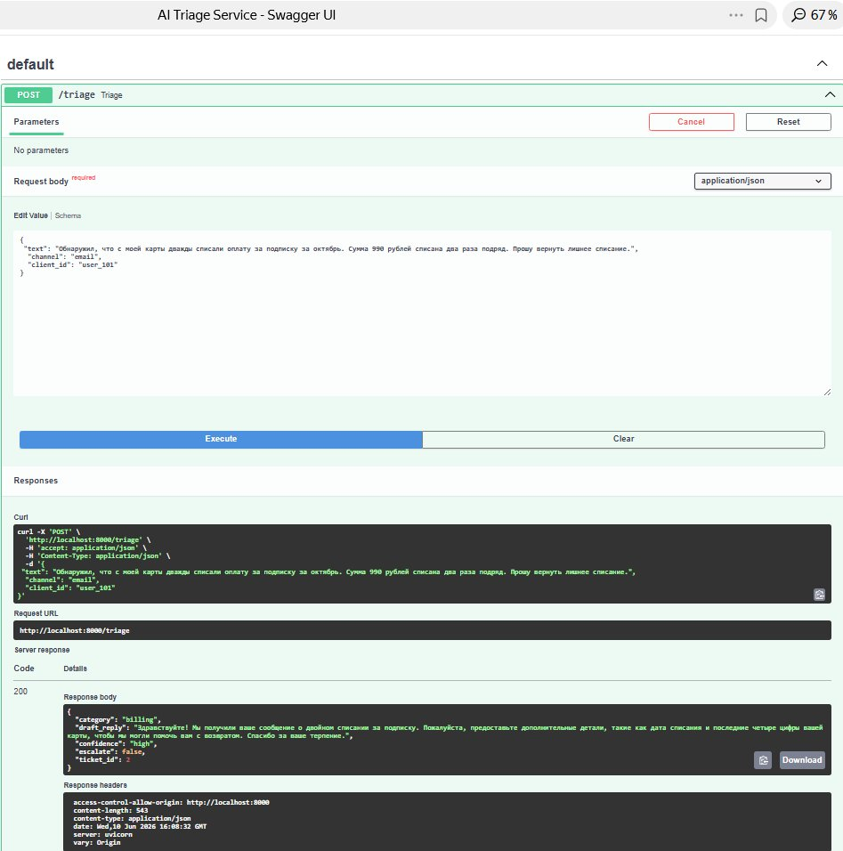
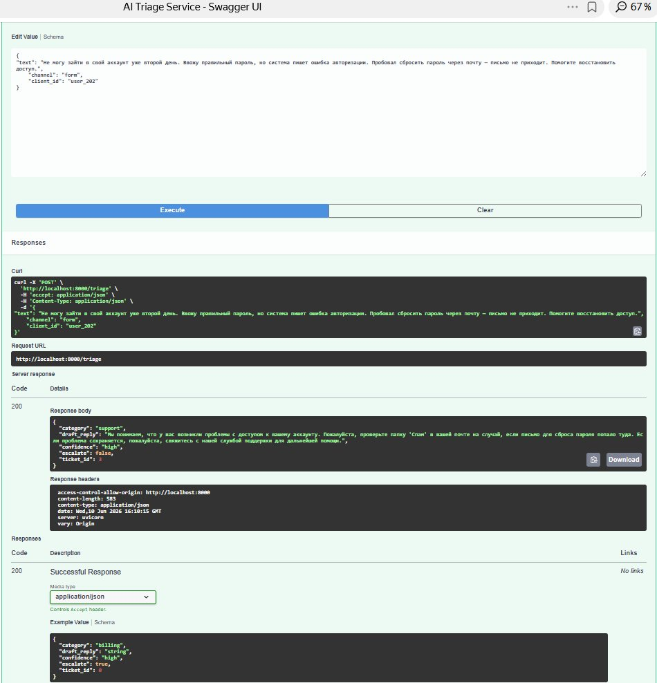
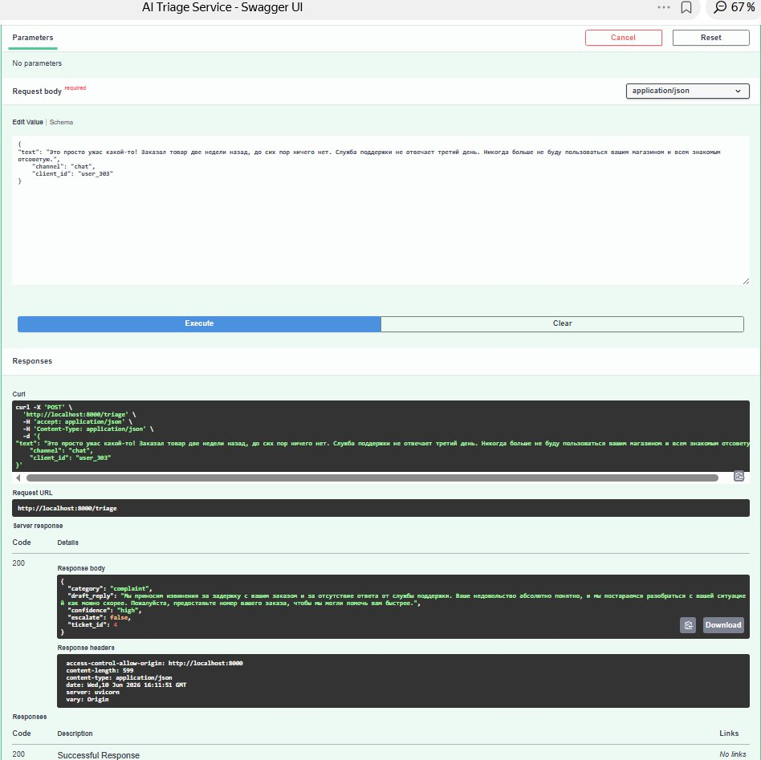
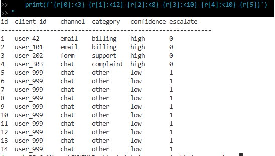
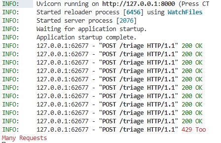

# AI Triage Service

> ИИ-сервис первичной обработки обращений клиентов: классификация + черновик ответа + аудит-лог + эскалация при сбоях.

[](https://www.python.org/)
[](https://fastapi.tiangolo.com/)
[](https://openai.com/)
[](https://www.sqlite.org/)
[](https://www.docker.com/)

---

## Проблема

Менеджеры поддержки тратят время на ручную сортировку входящих обращений. Сервис берёт на себя:
- **классификацию** (billing / support / complaint / other)
- **черновик ответа** (1–6 предложений, только по факту)
- **эскалацию** при низкой уверенности или сбое LLM
- **аудит-лог** всех обращений в SQLite

---
## Business Value

Сервис позволяет:

- сократить время первичной обработки обращений;
- автоматически маршрутизировать запросы;
- ускорить работу поддержки;
- снизить риск потери обращений;
- собирать историю для последующего анализа качества.


## Архитектура

<текущая схема>

## Request Flow

```text
Client Request
      │
      ▼
POST /triage
      │
      ▼
Pydantic Validation
      │
      ▼
Rate Limiter
      │
      ▼
GPT-4o-mini
      │
      ├── Success
      │      │
      │      ▼
      │  Category + Draft Reply
      │
      └── Failure
             │
             ▼
      Escalate to Human
             │
             ▼
       Template Reply
      │
      ▼
SQLite Audit Log
      │
      ▼
JSON Response
``` 

---


## Демо

🎥 [Демо-видео: запрос → ответ → запись в БД](ССЫЛКА_НА_ВИДЕО)

**Billing — двойное списание**


**Support — не могу войти в аккаунт**


**Complaint — жалоба на сервис**


**Запись в базе данных**


**Rate limit — 11-й запрос возвращает 429**


---

## Быстрый старт (локально, Python 3.12)

```bash
# 1. Клонировать
git clone https://github.com/KirillTomenko/ai-triage-service.git
cd ai-triage-service

# 2. Виртуальное окружение
python3.12 -m venv .venv
source .venv/bin/activate          # Windows: .venv\Scripts\activate

# 3. Зависимости
pip install -r requirements.txt

# 4. Переменные окружения
cp .env.example .env
# Откройте .env и вставьте ваш ключ ProxyAPI:
# OPENAI_API_KEY=sk-...

# 5. Запуск
uvicorn app.main:app --reload
```

Swagger UI → http://localhost:8000/docs

---

## Запуск через Docker

```bash
cp .env.example .env
# Заполните OPENAI_API_KEY в .env

docker compose up --build
```

---

## API

### `POST /triage`

**Запрос:**
```json
{
  "text": "Мне выставили двойной счёт за прошлый месяц",
  "channel": "email",
  "client_id": "user_42"
}
```

**Ответ (200):**
```json
{
  "category": "billing",
  "draft_reply": "Здравствуйте! Приносим извинения за неудобства. Мы изучим ситуацию с двойным начислением и свяжемся с вами в течение 1 рабочего дня.",
  "confidence": "high",
  "escalate": false,
  "ticket_id": 1
}
```

**Ошибка 429 (rate limit):**
```json
{"detail": "Rate limit exceeded: max 10 requests per 60s for this client."}
```

---

## Переменные окружения

| Переменная | Описание | По умолчанию |
|---|---|---|
| `OPENAI_API_KEY` | Ключ ProxyAPI | **обязательно** |
| `OPENAI_BASE_URL` | Базовый URL | `https://api.proxyapi.ru/openai/v1` |
| `OPENAI_MODEL` | Модель | `gpt-4o-mini` |

---

## База данных

Таблица `tickets` (SQLite, `data/tickets.db`):

| Поле | Тип | Описание |
|---|---|---|
| `id` | INTEGER PK | Авто-инкремент |
| `created_at` | DATETIME | Время создания |
| `client_id` | TEXT | ID клиента |
| `channel` | TEXT | email / form / chat |
| `text` | TEXT | Текст обращения |
| `category` | TEXT | Результат классификации |
| `confidence` | TEXT | Уверенность модели |
| `escalate` | INTEGER | 0/1 |
| `draft_reply` | TEXT | Черновик ответа |
| `error` | TEXT | Ошибка LLM (если была) |

---

## Надёжность

- **Rate limit:** 10 запросов / 60 сек на `client_id` (скользящее окно)
- **Fallback:** при любой ошибке LLM → `escalate=true`, `draft_reply` = шаблон «передано оператору»
- **Секреты:** только через `.env`, ключи не хранятся в коде
- **Логирование:** каждый тикет логируется в stdout с уровнем INFO

---

## Стек

- Python 3.12 · FastAPI · Uvicorn
- OpenAI SDK → ProxyAPI (gpt-4o-mini, temperature=0.2)
- aiosqlite · pydantic-settings
- Docker / docker-compose
